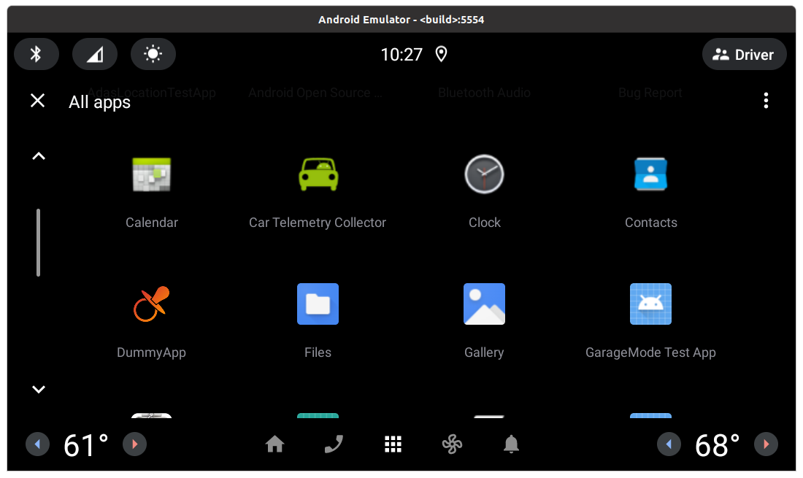
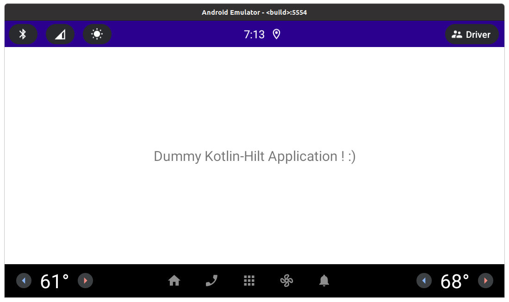
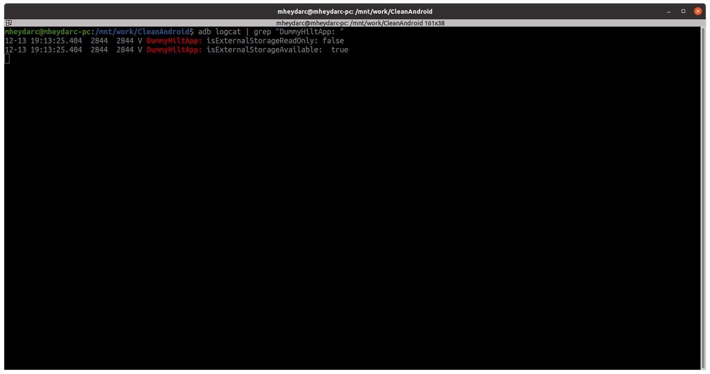

# AOSP-HILT-Example
A sample of using Hilt library in AOSP development

### This example hows how you can use Hilt & Kotlin in an AOSP app.
### The projects can't be built by Gradle anymore because of the fixes applied to the classes inheritence. But you can use Android studio for developing your code.

## Building AOSP

#### If you havn't cloned and set up AOSP locally you can read the article below:
[How to build AOSP](https://aospinsight.com/how-to-build-aosp/)

#### After cloning the repo create a new folder inside AOSP and rename it to "vendor". Then copy "aospinsight" folder to "vendor".